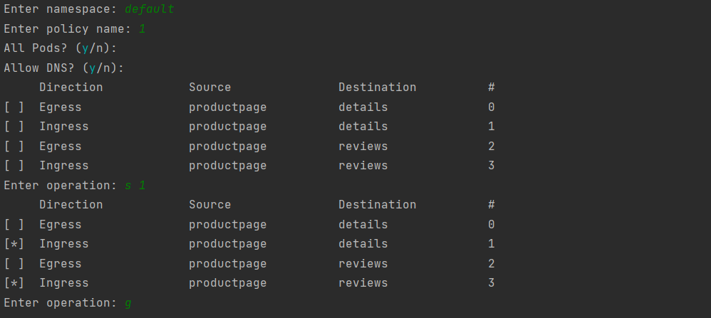

# Weave Editor

Weave Editor is a system that can capture the east/west flow inside the cluster based on a modified version of weave scope and automatically generate network policies according to aggregated flow.


## Brief View of the System


## Environment Requirements

The environment requirements of the system is listed as below.

##### Compulsory

- Kubernetes `v1.22` or `v1.23`
- Use Docker as CRI

##### Recommended

- Cluster built on Ubuntu 20.04 LTS
- Python 3.9


## Run the Flow Capturing System

### On Master Node

#### Prepare Files

First, copy the folder [master-node-codes](master-node-codes/) to the master node of the cluster for the future use.

#### Deploy Modified Weave Scope on Cluster

We offer two ways to deploy modified weave scope on the cluster.

##### One-Step Deploy (Recommended)

The image of modified Weave Scope is already pushed to Docker Hub, and some configuration YAML files are provided under [weavescope-deploy](master-node-codes/weavescope-deploy).

```shell
master-node-codes/weavescope-deploy/
├── latest.yaml 	# the latest version
├── original.yaml 	# the original version of Weave Scope (unmodified)
└── version-1.yaml 	# the stable version
```

You can directly deploy it with the following commands on master node.

```shell
cd master-node-codes/weavescope-deploy/
kubectl apply -f version-1.yaml
# check whether Weave Scope has been deployed on the cluster
kubectl get pods -n weave
```

##### Build from Source Code

You can also build image of Weave Scope and deploy it from the source code on your own. The source code of the modified version of Weave Scope can be found [here](https://github.com/WHALEEYE/weave-scope).

```shell
# clone the repository
git clone git@github.com:WHALEEYE/weave-scope.git
cd weave-scope/
# do whatever you want to the source code!

# build from source code
make

# wait for complete, then check local docker images
# you should see an image weaveworks/scope with tag latest
docker images
```

Then you should change the image names in the deploy configuration YAML files to your local image (you should also specify the `imagePullPolicy` to `Never` or `IfNotPresent`). After that, you can deploy your version of Weave Scope by using `kubectl apply` command just like above.

#### Start the Websocket Server

After all the pods of weave scope have fully prepared, you can start the websocket server on the master node with the following steps.

```shell
cd master-node-codes/script
# start the port forward of weave scope app
# so that we can access it from other machines
./start_proxy.sh # this will block the shell

# Open another shell
cd master-node-codes/script
./send_data.sh # this will block the shell
```

After executing the commands above, the websocket server will be started and listening on port `8765` of any IP addresses. All flow generated **after that** will be recorded by the server and sent to client.

Also, a weave scope HTTP server will be exposed to port `4040`.

You can modify the opened ports by modifying `ws_server.py` and `start_proxy.sh`.

### On Processing Machine

The processing machine can be any computer with Python 3 installed.

#### Start the Websocket Client

The code of websocket client is under [this folder](./processing-codes/client-cap).

```powershell
cd processing-codes/client-cap
python3 ws_client.py
```

The default IP address of the master node is `localhost`. You can modify the IP addresses and ports by editing `ws_client.py`.

After startup, the flow captured will be processed and recorded in `processing-codes/data/flows.json`.


## Policy Generation

You can generate policy with `generator.py` with captured flow file anytime on any machine with Python 3. Just run `processing-codes/poicy-generator/generator.py`, and it will first let you enter some options.

- `namespace`

  The namespace of the policy. Each NetworkPolicy of K8s should belong to one namespace, and the policy generator will only display the connections related to this namespace.

- `policy name`

- `allow DNS`

  Whether allow connections with `kube-dns`. The default value is `true`.

- `all pods`

  Whether to apply single network policy to all pods in the namespace or split them to different network policies. The default value is `true`.

  About the information of these two modes, see [this section](#All Pods?).

After entering these options, it will read the flows from `processing-codes/data/flows.json`, display the aggregated connections and let the user to enter commands.



The following commands are supported.

- `s [connection #]`

  Select one connection into policy.

- `c [connection #]`

  Cancel one selection.

- `g`

  Generate policy YAML files.

The generated YAML files will be inside folder `processing-codes/policies/[policy name]/`. You can apply the policies with command `kubectl apply -f [policy folder]`.


## Generate Test Flows

You can deploy a simple application with the following command on **master node**.

```shell
export MYHOST=$(kubectl config view -o jsonpath={.contexts..namespace}).bookinfo.com
kubectl apply -l version!=v2,version!=v3 -f https://raw.githubusercontent.com/istio/istio/release-1.13/samples/bookinfo/platform/kube/bookinfo.yaml
# check pod status
kubectl get pods

kubectl apply -f https://raw.githubusercontent.com/istio/istio/release-1.13/samples/sleep/sleep.yaml
```

After all pods are ready, start the capturing system and run `master-node-codes/scripts/create_flow.sh`. Some flow in this application will be created and captured. Once you run the policy generator, you should see the connections between services `productpage`, `details` and `reviews`.


## All Pods?

We can choose whether to apply single network policy to all pods in the namespace or split them to different network policies. So what's the difference between them?


The two figures above demonstrates the difference when `all pods` is true and false. We'll use a tube-like icon to represent rules (i.e. an entry in policy file).

The left figure shows the situation where it is true. Under this case, the network policy will be applied to every pod inside the namespace. From that we can see that the connection A-E and B-E is aggregated to one rule. This is because the policy can't distinguish service A and service B, because they are all inside the same namespace, and their destination service and port is the same. When `all pods` is true, only one policy file will be generated.

While in the right figure, we will use pod selector in each policy file, so that each service in the namespace will have an exclusive policy file. Under this case, there will be one rule for each of the connection A-E and B-E (and the entries are separated into two policy files). When `all pods` is false, multiple policy files may be generated.


## Need More Information?

If you need more detailed information the code or implementation, feel free to check the [spec](./spec.md) and source codes.
